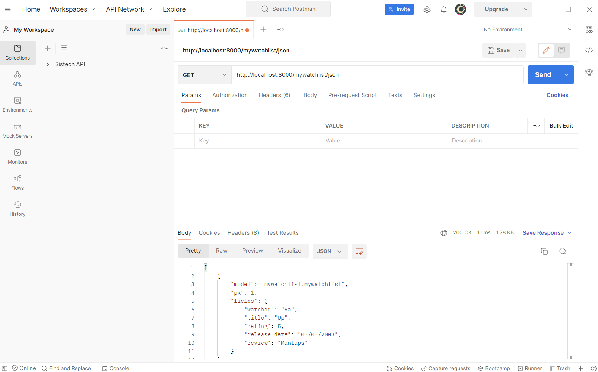
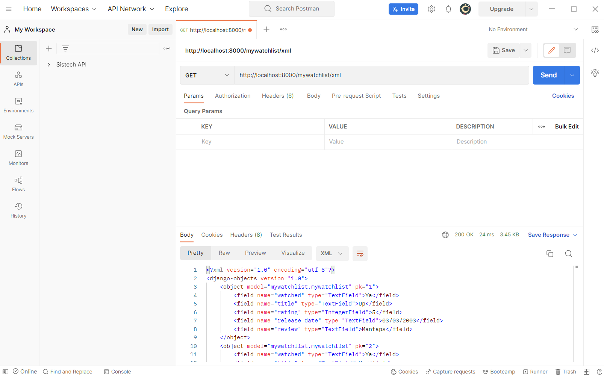

# Jelaskan perbedaan antara JSON, XML, dan HTML!
HTML merupakan sebuah markup language untuk dokumen yang didesain untuk ditampilkan pada web browser. 

XML merupakan suatu markup language yang didesain untuk menyimpan data. XML banyak digunakan untuk mentransfer data. XML bersifat case sensitive.

JSON merupakan sebuah format file yang mudah dibaca oleh manusia dan digunakan untuk menyimpan serta mentransfer objek data. Objek data pada file JSON berupa pasangan atribute dan value.

Perbedaan JSON dan XML:
1. Object JSON memiliki tipe (string, number, array, dan boolean) sementara semua data XML harus berbentuk string.
2. Pada JSON data sudah tersedia dan accessible sebagai onjek JSON sementara data XML harus di parsed.
3. JSON didukung oleh kebanyakan browsers sementara proses parsing data XML agak tricky.
4. JSON bukan merupakan markup language sehingga JSON tidak memiliki kemampuan untuk mendisplay data seperti XML.
5. JSON hanya mendukung tipe data number sementara XML mendukung berbagai macam tipe data.
6. Pengembalian value pada JSON lebih mudah dilakukan daripada XML.
7. JSON didukung oleh banyak Ajax toolkit sementara XML tidak seluruhnya didukung Ajax toolkit.
8. Developer tidak harus menuliskan JavaScript secara manual untuk melakukan serialize/deserialize pada JSON, hal ini tidak berlaku pada XML.
9. JSON merupakan native support untuk object sedangkan pada XML object harus diekspresikan melalui suatu konvensi.
10. JSON hanya mendukung penggunaan UTF-8 encoding sementara XML mendukung berbagai macam encoding.
11. JSON tidak mendukung penggunaan komen sementara XML mendukung penggunaan komen.
12. File JSON lebih mudah dibaca dibandingkan dengan file XML.
13. JSON tidak mendukung penggunaan namespaces, sementara XML mendukung penggunaan namespaces.
14. JSON kurang aman dibandingkan dengan XML.

Perbedaan XML dan HTML: 
1. Penggunaan XML berfokus untuk mentransfer data sementara penggunaan HTML berfokus pada presentasi data.
2. XML bersifat content driver sementara HTML bersifat format driven.
3. XML memiliki karakteristik berupa case sensitive sementara HTML bersifat case insensitive.
4. XML mendukung penggunaan namespaces sementara HTML tidak.
5. XML lebih strict dalam penggunaan closing tag dibandingkan dengan HTML.
6. TAg pada XML bersifat extensible dan bukan merupakan predefined tag sementara HTML memiliki tag yang terbatas serta merupakan predefined tag.

Perbedaan JSON dan HTML:
1. JSON merupakan sebuah bahasa yang umumnya digunakan untuk menyimpan dan mentransfer data sementara HTML merupakan sebuah bahasa yang digunakan untuk menampilkan struktur dan konten dari sebuah halaman web.
2. JSON bersifat lebih fleksibel dibandingkan dengan HTML.
JSON memudahkan developer dalam menyimpan data yang bersifat lebih kompleks.

# Jelaskan mengapa kita memerlukan data delivery dalam pengimplementasian sebuah platform?
Dalam mengembangkan suatu platform, memiliki data yang terkonsolidasi dalam suatu repositori menjadi suatu hal yang penting untuk kebutuhan analisis. Ada kalanya juga, beberapa data berada pada stack yang berbeda sehingga perlu ditransfer dari satu stack ke stack yang lainnya.

# Jelaskan bagaimana cara kamu mengimplementasikan checklist di atas
1. Membuat suatu aplikasi baru bernama mywatchlist di proyek Django Tugas 2 pekan lalu
menggunakan python manage.py startapp < nama aplikasi >
2. Menambahkan path mywatchlist sehingga pengguna dapat mengakses http://localhost:8000/mywatchlist
Menambahkan path('mywatchlist/', include('mywatchlist.urls'))
3. Membuat sebuah model MyWatchList
Menambahkan class MyWatchList pada models.py
class MyWatchList(models.Model):
    watched = models.TextField(max_length=50)
    title = models.TextField(max_length=100)
    rating = models.IntegerField()
    release_date = models.TextField()
    review = models.TextField(max_length=255)
4. Menambahkan minimal 10 data untuk objek MyWatchList
Membuat folder fixture berisi file initial_mywatchlist_data.json yang berisi
{
        "model": "mywatchlist.mywatchlist",
        "pk": 1,
        "fields": {
            "watched": "Ya",
            "title": "Up",
            "rating": 5,
            "release_date": "03/03/2003",
            "review": "Mantaps"
        }
    },
5. Mengimplementasikan sebuah fitur untuk menyajikan data yang telah dibuat sebelumnya dalam tiga format
- Membuat fungsi yang menerima parameter request pada file views.py
- Membuat variabel dalam fungsi yang menyimpan hasil query dari seluruh data
- Menambahkan fitur return function berupa HttpResponse yang berisi data hasil query yang sudah diserialisasi dalam format data yang diminta
6. Membuat routing sehingga data di atas dapat diakses melalui URL
Mengimport fungasi yang telah dibuat pada urls.py dan menambahkan path url ke dalam urpatterns untuk mengakses fungasi yang sudah diimpor.

# Screenshot Postman
## JSON

## XML

